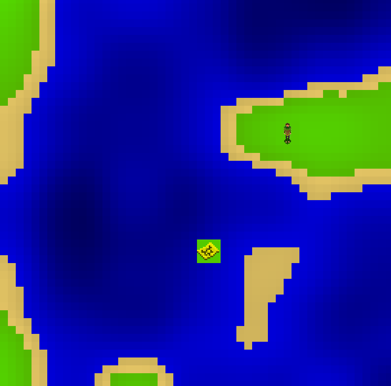
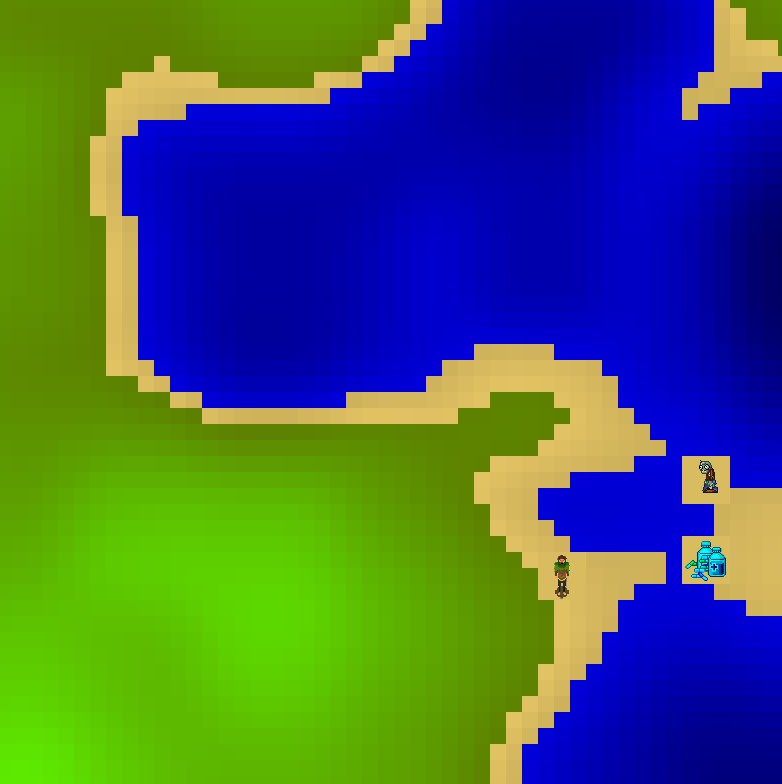
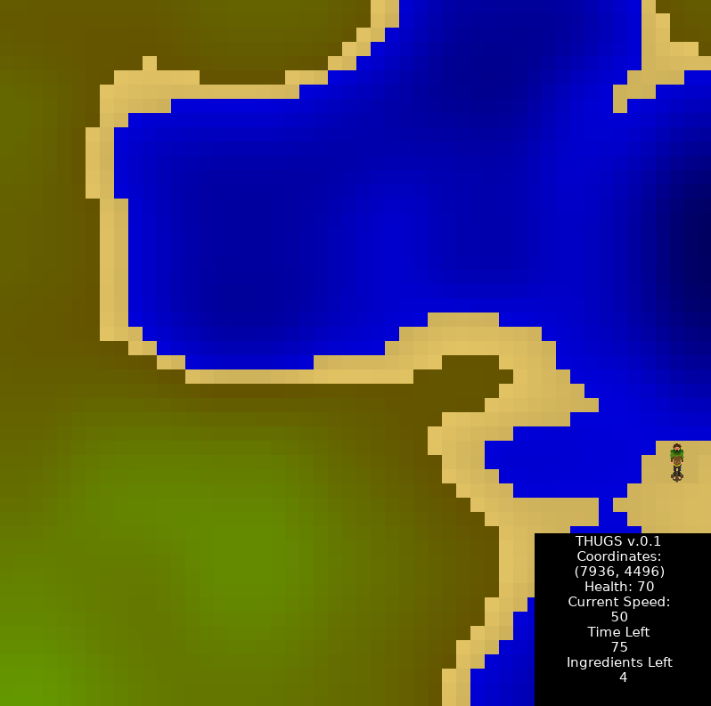
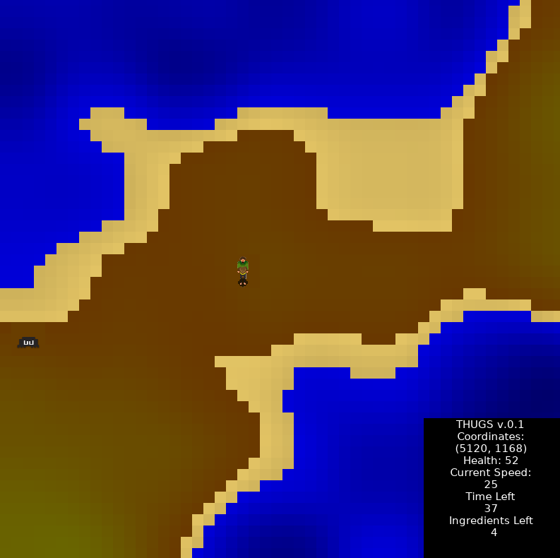
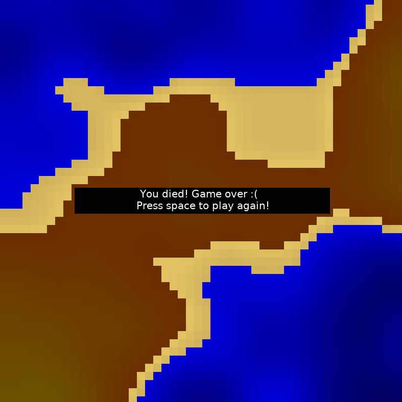
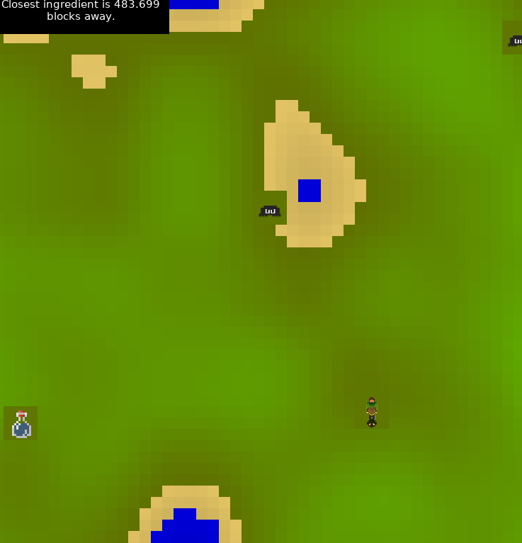

# Final Project

Read [this document](https://cliutils.gitlab.io/modern-cmake/chapters/basics/structure.html) to understand the project
layout.

CS 126 Final Project: THUGS (The Half-Baked Unimportant Game: Singleplayer)
-
THUGS is a single-player indie game, where the basic objective of the game is to explore a procedurally generated terrain and collect
ingredients scattered through the map to cure a zombie apocalypse. The player only has a certain amount of time (in this case, 4 minutes)
to complete the task, or else the terrain will decay and the game will end.

### Terrains

Terrains are generated procedurally using the current system time as a seed: that is, no two worlds are the exact same.

### Ingredients

Ingredients flash in rainbow colors to make it clear to the user that it's an item to pick up.

Pressing F1 opens up a console window with numerous game statistics on it, such as how much time is left, how many ingredients you have left, and
the players' coordinates.

You'll also notice that the terrain decays over time. This is an indication to the user that time is running out.

### Mobs

As visible in the previous screenshots, mobs spawn in the map. Mobs include spiders and zombies. Spiders move horizontally, zombies move vertically.
Colliding with a mob causes you to lose health. If you run out of health, you will lose and the game will end.

### Maps
Maps are an important navigation tool in the game. Picking one up will show the user the distance to the closest ingredient.

**Author**: Davis Keene - [`davisk2@illinois.edu`](mailto:davisk2@illinois.edu)
